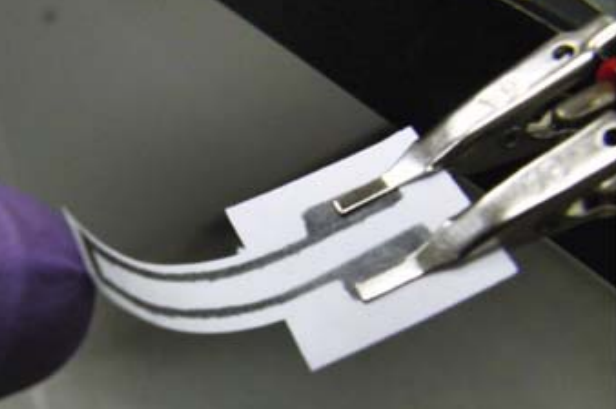

# 4GP 2024/2025 - Projet capteur *low-tech* en graphite - Par Esther BOIRON et Margot HERNANDEZ

## Table des matières
* [Contacts](#contacts) 
* [Contexte](#contexte) 
* [Livrable](#livrable) 
* [Matériel requis](#matériel-requis)  
○ [1. Simulation sous LTSpice](#1--simulation-sous-ltspice)  
○ [2. Design du PCB sous Kicad](#2--design-du-pcb-sous-kicad)  
[3. Code sur Arduino](#3--code-sur-arduino)  
[4. Application Android](#4--application-android)  
[5. Réalisation du shield](#5--réalisation-du-shield)  
[6. Banc de test](#6--banc-de-test)  
[7. Résultats](#7--résultats)  
[8. Datasheet du capteur](#8--datasheet-du-capteur) 
* [Conclusion](#conclusion)
------------
## Contacts
Esther BOIRON : eboiron@insa-toulouse.fr  
Margot HERNANDEZ : mhernan2@insa-toulouse.fr

------------
## Contexte
Dans le cadre de l'UF de quatrième année du département Génie Physique intitulé *Du capteur au banc de test*, nous avons conçu puis évalué la performance d'un capteur *low tech* en graphite. Il s'agit d'un capteur très simple consitué d'un morceau de papier recouvert d'une trace de crayon à papier formant une fine couche de graphite. 

Ce travail se base sur des études de chercheurs américain (Cheng-Wei Lin*, Zhibo Zhao*, Jaemyung Kim & Jiaxing Huang) qui publient en 2014 l'article [Pencil Drawn Strain Gauges and Chemiresistors on Paper](https://moodle.insa-toulouse.fr/mod/resource/view.php?id=60418).

Vous trouverez ici tout ce qui a été fait dans le cadre de ce projet.

------------
## Livrable
------------
## Matériel requis
------------
## Simulation sous LTSpice
------------
## Design du PCB sous Kicad
------------
## Code sur Arduino
------------
## Application Android
------------
## Réalisation du shield
------------
## Banc de test
------------
## Résultats
------------
## Datasheet du capteur
Vous pouvez trouver la datasheet du capteur ici. (mettre lien du PDF)

------------
## Conclusion
